# Speech-to-Text + Generador de Exámenes (Español)

Demo inicial para transcripción de audio a texto y generación automática de exámenes en español.

## Diagrama de Flujo



## Funcionalidad de la Demo

Esta aplicación realiza las siguientes funciones:

### 1. Transcripción de Audio a Texto
- **Entrada**: Archivo de audio en español (WAV, MP3, FLAC - máx. 10MB)
- **Proceso**: 
  - Usa el modelo Whisper de OpenAI configurado específicamente para español
  - Preprocesamiento del audio para mejorar la calidad de la transcripción
- **Salida**: 
  - Texto transcrito en español
  - Opción de descargar el texto en formato .txt
  - Vista previa de fragmento (primeros 200 caracteres)

### 2. Generación de Exámenes
- **Entrada**: Texto transcrito del paso anterior
- **Proceso**:
  - Usa un modelo de lenguaje ligero (DistilGPT-2)
  - Genera preguntas de opción múltiple basadas en el contenido
  - Formato estándar: 3 opciones (A, B, C) con indicación de respuesta correcta
- **Salida**:
  - Examen generado en español
  - Opción de descargar el examen en formato .txt

### 3. Características Técnicas
- **Idioma**: Exclusivamente español
- **Modelos**:
  - Whisper (base) para transcripción
  - DistilGPT-2 para generación de preguntas
- **Procesamiento**:
  - Normalización de audio
  - Manejo de archivos temporales
  - Validación de formatos y tamaños

## Instalación

### Requisitos del Sistema
- **Python**: 3.10 (recomendado) o 3.8-3.11
- **Memoria RAM**: Mínimo 4GB (8GB recomendado para procesamiento de audio)
- **Almacenamiento**: 2GB libres (para modelos de ML)
- **Sistema**: Windows 10+, macOS 10.15+, Linux

### Pasos de Instalación

1. **Clonar el repositorio**:
   ```bash
   git clone https://github.com/MarioCastilloSan/stt
   cd sstext
   ```

2. **Verificar versión de Python**:
   ```bash
   python --version  # Debe ser 3.10.x
   ```

3. **Crear entorno virtual**:
   ```bash
   python -m venv venv
   source venv/bin/activate  # Windows: venv\Scripts\activate
   ```

4. **Instalar dependencias**:
   ```bash
   pip install --upgrade pip
   pip install -r requirements.txt
   ```

5. **Ejecutar la aplicación**:
   ```bash
   streamlit run app/streamlit_app.py
   ```

## Uso de la Aplicación

1. **Subir archivo de audio**:
   - Haz clic en "Selecciona un archivo de audio en español"
   - Elige un archivo WAV, MP3 o FLAC (máx. 10MB)
   - El sistema validará el formato y tamaño

2. **Transcripción**:
   - Espera a que aparezca el mensaje "Transcribiendo audio a español..."
   - Verás el texto transcrito en el área de texto
   - Puedes descargar el texto usando el botón "📥 Descargar texto"

3. **Generar examen**:
   - Haz clic en "Generar examen en español"
   - Espera a que aparezca "Generando preguntas en español..."
   - Verás las preguntas generadas en el área de texto
   - Puedes descargar el examen usando el botón "📥 Descargar examen"

4. **Fragmento de muestra**:
   - Se muestra automáticamente un extracto del texto transcrito
   - Útil para verificar rápidamente la calidad de la transcripción

## Estructura del Proyecto

```
sstext/
├── src/                    # Módulos principales
│   ├── sttext/            # Speech-to-Text
│   │   ├── __init__.py
│   │   └── transcriber.py
│   ├── exam_generator/    # Generador de exámenes
│   │   ├── __init__.py
│   │   ├── generator.py
│   │   └── prompts.py
│   └── utils/             # Utilidades
│       ├── __init__.py
│       ├── file_handler.py
│       └── audio_processor.py
├── app/                   # Aplicación Streamlit
│   ├── __init__.py
│   └── streamlit_app.py
├── config/                # Configuración
│   ├── __init__.py
│   └── settings.py
├── requirements.txt        # Dependencias
├── diagram.svg            # Diagrama de flujo
└── README.md              # Este archivo
```

## Tecnologías Utilizadas

| Componente          | Tecnología                | Versión   |
|---------------------|---------------------------|-----------|
| **Framework UI**    | Streamlit                 | 1.28.0    |
| **Speech-to-Text**  | Whisper (OpenAI)          | 20231117  |
| **Generación Texto** | Transformers (DistilGPT-2)| 4.35.2    |
| **Procesamiento Audio** | Librosa                | 0.10.1    |
| **Manejo Audio**    | SoundFile                 | 0.12.1    |
| **Validación**      | Pydantic                  | 2.5.0     |

## Limitaciones Actuales

1. **Idioma**: Solo soporta español
2. **Tamaño de audio**: Máximo 10MB
3. **Modelos**: 
   - Whisper base (para balance velocidad/precisión)
   - DistilGPT-2 (generación básica de preguntas)
4. **Formatos**: Solo WAV, MP3 y FLAC
5. **Persistencia**: No hay base de datos (los resultados se descargan)

## Próximos Pasos

1. **Mejoras en modelos**:
   - Fine-tuning de Whisper para español específico
   - Modelo de generación más especializado

2. **Características adicionales**:
   - Soporte para más idiomas
   - Generación de diferentes tipos de preguntas
   - Evaluación automática de respuestas

3. **Infraestructura**:
   - Persistencia con SQLite
   - API REST con FastAPI
   - Despliegue en la nube

4. **Optimizaciones**:
   - Procesamiento por lotes
   - Caché de modelos
   - Compresión de modelos

## Contribuciones

Las contribuciones son bienvenidas. Por favor, sigue estos pasos:

1. Haz un fork del repositorio
2. Crea una rama para tu feature (`git checkout -b feature/nueva-funcionalidad`)
3. Commit tus cambios (`git commit -am 'Agrega nueva funcionalidad'`)
4. Push a la rama (`git push origin feature/nueva-funcionalidad`)
5. Crea un Pull Request

## Licencia

Este proyecto está bajo la Licencia MIT - ver el archivo [LICENSE](LICENSE) para detalles.

## Contacto

Mario Castillo Sanhueza mariocastillosan@gmail.com
Mi página [https://mcastillosan.online/]https://mcastillosan.online/

Proyecto Link: [https://github.com/MarioCastilloSan/stt/tree/demo?tab=readme-ov-file](https://github.com/MarioCastilloSan/stt/tree/demo?tab=readme-ov-file)